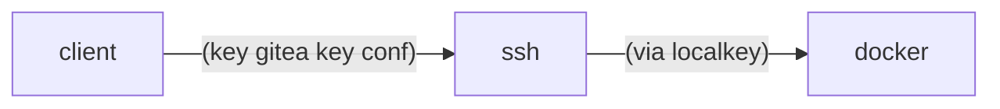

## adapt env.sample > .env

```
GITEAUSER=gitea
URL=server.com
URI=/tea
EMAIL=example_email

ACME_URL=https://smallstep-crt/acme/acme/directory
ACME_CA_ROOT=-/etc/ssl/cert.pem
```

## SSH shim



* create a ssh user (USER) gitea (use UID/GID from new user in docker)
* cp gitea.host /usr/local/bin/gitea
* generate a key for gitea and add public in authorized_key


## Installation

Go on $URL/$URI check parameter and next.
