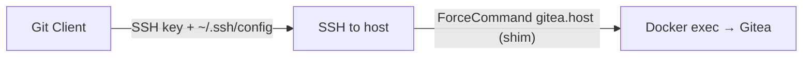

# Gitea

Installation script for Caddy / Docker / Gitea.

This script deploys a Gitea instance behind a Caddy reverse proxy with automatic HTTPS via ACME.

---

## Configuration: adapt `env.sample` to `.env`

Repositories will be accessible via:
- **SSH**: `git://GITEAUSER@URL` (e.g., `git://gitea@server.com`)
- **HTTPS**: `https://$URL/$URI` (e.g., `https://server.com/tea`)

### Environment variables (`.env`)

```bash
# System user for Gitea (must match the SSH user created)
GITEAUSER=gitea

# Public domain name of the server
URL=server.com

# Base path for Gitea web UI (e.g., /tea → https://server.com/tea)
URI=/tea

# Email for ACME registration (Let's Encrypt / Smallstep)
EMAIL=example_email

# ACME server URL (here Smallstep CA)
ACME_URL=https://smallstep-crt/acme/acme/directory

# Path to CA root certificate for ACME validation
ACME_CA_ROOT=-/etc/ssl/cert.pem
```

---

## SSH Shim (Git access over SSH)

The SSH shim allows users to clone/push via SSH to the Docker Gitea container.

### Setup steps

1. **Create a system user** (e.g., `gitea`) — use the same UID/GID as in the `.env` file
2. **Install the shim script**: copy `gitea.host` to `/usr/local/bin/gitea`
3. **Generate an SSH key** for the `gitea` user and add the public key to `~gitea/.ssh/authorized_keys`

### SSH connection flow



**Explanation**:
- User connects via SSH to the host with their key
- The `ForceCommand` in `authorized_keys` executes `/usr/local/bin/gitea` (auto generate via gitea webUI)
- This script runs command via ssh git@localhost ie: the Gitea container to serve the Git command.

---

## Installation

1. Create your "gitea" ssh local user 
2. Copy `env.sample` to `.env` and adjust values
3. Run `docker compose up -d`
4. Go to `https://$URL/$URI` (e.g., `https://server.com/tea`)
5. Follow the Gitea setup wizard (database, admin user, etc.)
